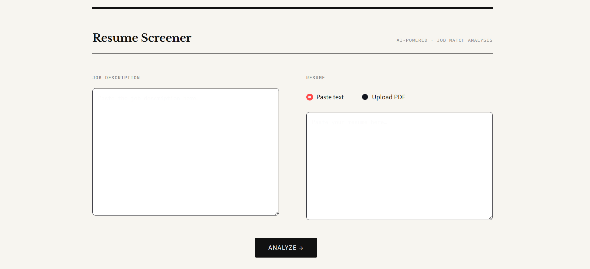

# Resume Screener

> AI-powered resume analysis tool that matches resumes to job descriptions.

## Demo



## Features

- [x] PDF upload support
- [x] Raw text input support
- [x] Keyword extraction via ESCO taxonomy
- [x] Semantic similarity score
- [x] LLM feedback via Hugging Face Inference API
- [x] Streamlit frontend

## Tech Stack

- FastAPI
- Streamlit
- sentence-transformers
- Hugging Face Inference API
- PyMuPDF

## Getting Started

### Prerequisites

- Python 3.12
- pip

### Installation

```bash
# Clone the repo
git clone https://github.com/AbdelazizAushar/resume-screener.git
cd resume-screener

# Create and activate virtual environment
python -m venv venv
venv\Scripts\activate  # Windows
source venv/bin/activate  # Mac/Linux

# Install dependencies
pip install -r requirements.txt
```

### Running Locally

Start the FastAPI backend:

```bash
uvicorn backend.main:app --reload
```

API will be available at `http://localhost:8000`

In a separate terminal, start the Streamlit frontend:

```bash
streamlit run frontend/app.py
```

Frontend will be available at `http://localhost:8501`

### API Endpoints

| Method | Endpoint   | Description                            |
| ------ | ---------- | -------------------------------------- |
| GET    | `/health`  | Health check                           |
| POST   | `/analyze` | Analyze resume against job description |

### Testing with Postman

For the `/analyze` endpoint:

- Set Body to **form-data**
- Add `job_description` as a text field
- Add either `resume_text` as a text field or `resume_file` as a file upload

## Project Structure

```
resume-screener/
├── backend/
│   ├── main.py
│   ├── routes/
│   │   └── api.py
│   ├── services/
│   │   ├── pdf_parser.py
│   │   ├── keyword_extractor.py
│   │   ├── similarity_scorer.py
│   │   └── llm_feedback.py
│   └── models/
│       └── schemas.py
├── frontend/
│   └── app.py
├── skills.csv
├── extra_skills.json
├── .env.example
├── .gitignore
├── .gitattributes
├── LICENSE
├── requirements.txt
└── README.md
```

## Environment Variables

Copy `.env.example` to `.env` and fill in your keys:

```bash
cp .env.example .env
```

| Variable   | Description                                                                                              | Required |
| ---------- | -------------------------------------------------------------------------------------------------------- | -------- |
| `HF_TOKEN` | Hugging Face token — get one at [huggingface.co/settings/tokens](https://huggingface.co/settings/tokens) | Yes      |

## Deployment

The app is live on Hugging Face Spaces:

- **Frontend:** https://huggingface.co/spaces/AbdelazizAushar/resume-screener-frontend
- **Backend:** https://huggingface.co/spaces/AbdelazizAushar/resume-screener-backend
